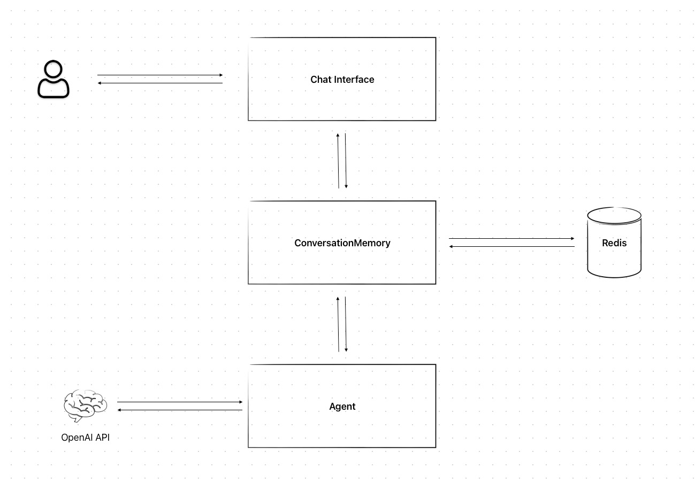

# AI Chatbot Microservices Architecture

This project is a sample AI chatbot built using a microservices architecture. It uses Docker to orchestrate multiple services, and NGINX as a reverse proxy to route requests to the appropriate services. 

## Overview

The project consists of three main services:

1. **ChatUI**: A user interface for interacting with the chatbot. It's built using JavaScript and runs in a Docker container.

2. **Conversation**: A service that manages and stores the state of each conversation. It's built using FastAPI and Redis, and runs in a Docker container.

3. **Assistant**: A service that generates responses to user inputs by interfacing with the OpenAI API. It's built using FastAPI and runs in a Docker container.

The architecture of this project involves the `ChatUI` service for the user interface, the `Conversation` service to manage and store conversation states, and the `Assistant` service to generate responses using the OpenAI API. These services are orchestrated using Docker Compose and requests are routed using an NGINX reverse proxy.

## Configuration

Before running the project, you need to configure your OpenAI API key. Copy the `.env.example` file to a new file named `.env` and replace `your-openai-api-key` with your actual OpenAI API key.

## Running the Project

To run this project, follow these steps:

1. Clone the repository.
2. Navigate to the root directory of the project.
3. Configure your OpenAI API key as described in the Configuration section above.
4. Run `docker-compose up` to start the services.
5. Access the ChatUI service in your browser at the port specified in the Docker Compose configuration file (default is 81, for example: http://localhost:81).

Please note that you need to have Docker and Docker Compose installed on your machine to run this project.

## Request Workflow

When a user interacts with the chatbot via the `ChatUI` interface, their inputs are sent to the `Conversation` service. The `Conversation` service then interacts with the `Assistant` service to generate responses, which are sent back to the user through the `Conversation` and `ChatUI` services.

Please note that this is a sample project and may not be suitable for production use without further modifications.